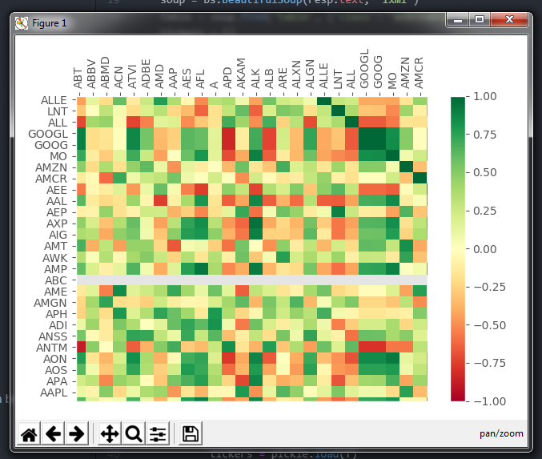

# PythonStocks

This is a project I decided to do as a fun side project and learning experience.

The goal of this project is to leverage my knowledge of programming and analytics in combination with my interest in investments and stocks.

The project currently has funcitonality of gathering all of the stock tickers from the S&P500, pulling their historical price action data
from Yahoo finance, and then storing these values in a pandas dataframe.

Once data is stored in a dataframe, we have many options on how to use this data. Currently, I have implemented a simple correlation visualizer
to show which stocks are both positively and negatively correlated.

Correlation Chart: 

